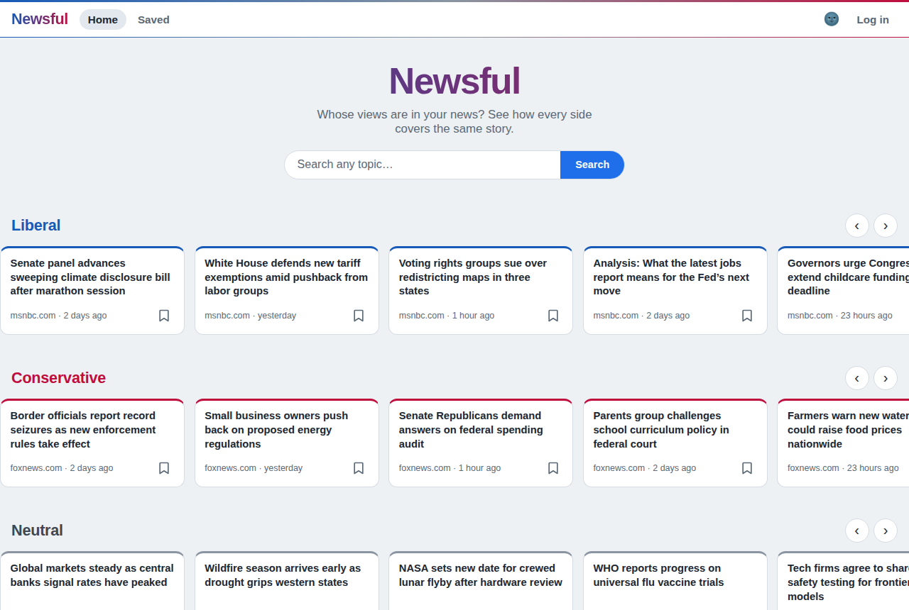
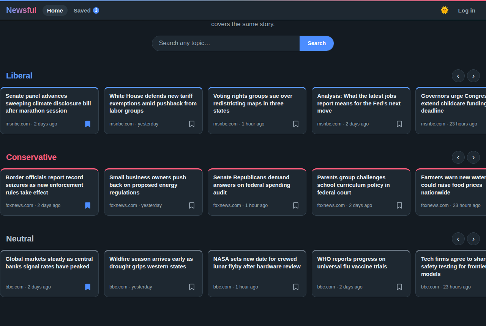
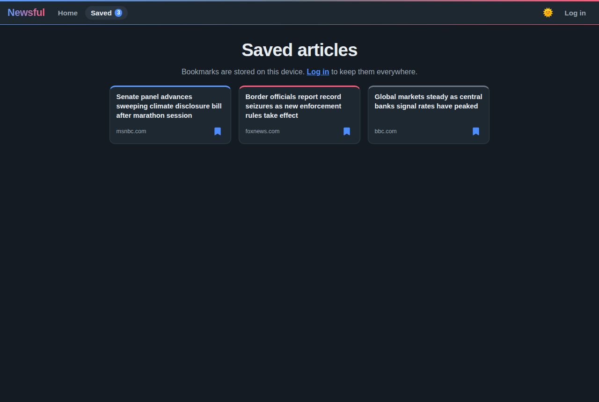

# Newsful

**Whose views are in your news?** Newsful shows you how conservative, liberal, and neutral news outlets report on the same stories, so you can spot the bias in what you read.

## How it works

Open the app and you're looking at the news — no account, no login wall.

* See today's top stories side by side across **Liberal**, **Conservative**, and **Neutral** outlets
* Search any topic and compare how each side covers it
* Bookmark articles with one tap — bookmarks work without an account (stored on your device)
* Optionally create an account to sync your bookmarks across devices; any bookmarks you saved as a guest are merged into your account when you log in
* Light and dark mode, following your system preference by default

Home page



Dark mode



Saved articles



*(Screenshots use placeholder headlines.)*

## Application Website

https://newsful.vercel.app/

## Development

```bash
npm install
npm run dev        # start dev server on http://localhost:3000
npm test           # run the test suite (Vitest + Testing Library)
npm run build      # production build to dist/
```

Optional environment variables (put them in `.env.local`):

| Variable | Purpose | Default |
| --- | --- | --- |
| `VITE_API_ENDPOINT` | Newsful API base URL | `https://newsful-api.onrender.com/api` |

News comes from the Newsful API, which aggregates free Google News RSS feeds per outlet — there is no news-API key to sign up for or expire.

## Technology

* React 19 + Vite
* React Router 7
* Vitest + React Testing Library
* Plain CSS with custom properties (design tokens, dark mode via `data-theme`)

The companion API lives at [newsful-api](https://github.com/lyunya/newsful-api) — Node 22, Express 5, and Postgres, with JWT auth for the optional accounts.
